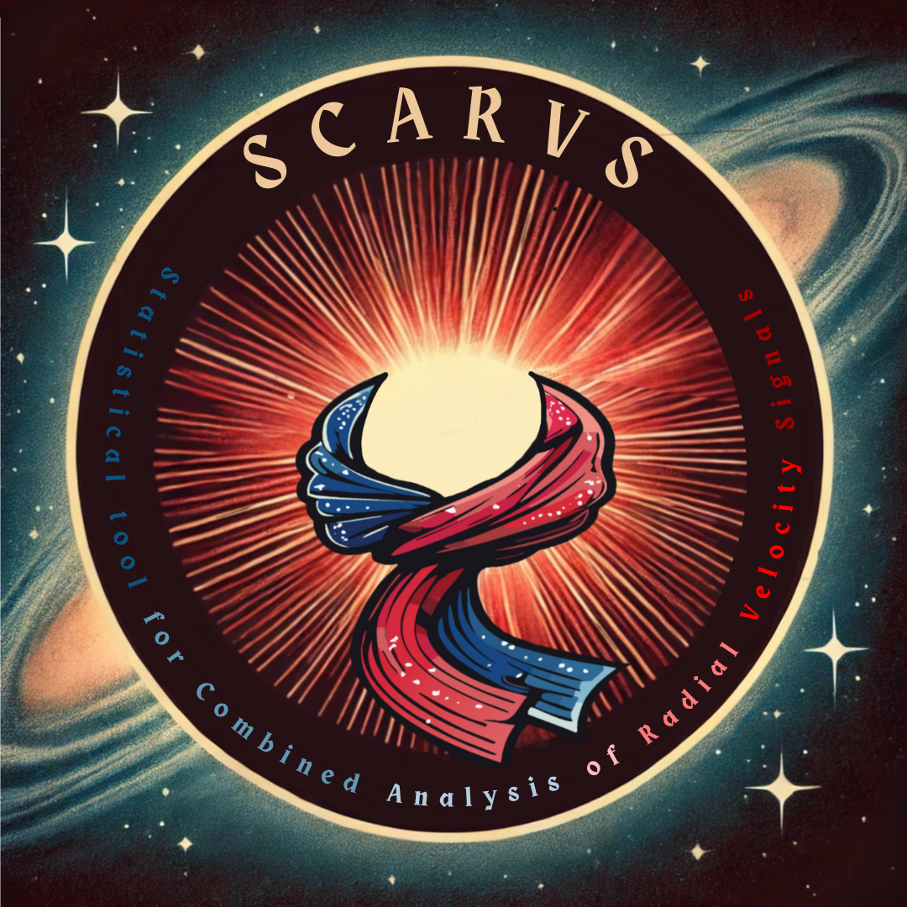

# SCARVS: Statistical tools for Combined Analysis of Radial Velocity Signals

---



## Contents

- [Introduction](#introduction)
- [Installation](#installation)
- [Setup](#setup)
- [Usage](#usage)
- [Dev mode](#dev-mode)

[Back to top](#contents)

---

## Introduction

Insert text here

## Installation

#### Step 1: Clone the repository

```bash
git clone git@github.com:njcuk9999/scarvs.git
```

#### Step 2: Install python 3.10 

Create a conda or python environment

e.g.

```bash 
conda create --name scarvs-env python=3.10
conda activate scarvs-env
```

#### Step 3: Install scarvs

```bash
cd {SCARVS_ROOT}
pip install -U -e .
```

Note on can also use venv (instead of conda)

Note `{SCARVS_ROOT}` is the path to the cloned github repository (i.e. /path/to/scarvs)

[Back to top](#contents)

---

## Setup

First [install scarvs](#installation).
Once you've done this activate the environment you installed scarvs in.
(e.g. `conda activate scarvs-env`)

To setup SCARVS, you need to run the following command:

```bash
scarvs_setup {yaml_file}
```

where `yaml_file` is the yaml file you wish to create (if left blank you 
will be asked for one).


[Back to top](#contents)

---

## Usage


### Command line

To run SCARVS, you need activate the environemnt you installed scarvs in.
(e.g. `conda activate scarvs-env`)

Then you need to run the following command:

```bash
scarvs_run --yamlfile={yaml_file}
```

[Back to top](#contents)

---

### Inside Python/Notebooks

To run SCARVS inside python, you need to import the scarvs module:

```python
from scarvs.recipes import scarvs_run

# define the path to your yaml file
yaml_file = '/path/to/yaml_file.yaml'

# run scarvs
scarvs_run.main(yaml_file=yaml_file)
```

### Overriding parameters

If you wish to override the yaml file, you can do so by passing in a dictionary
as follows:

```python

from scarvs.core import startup
from scarvs.core import general

# define the path to your yaml file
yaml_file = '/path/to/yaml_file.yaml'
# get parameters
params = startup.get_params(name='run', yaml_file=yaml_file)

# Define data path
params['DATA_DIR'] = '/path/to/data'

# Define plot path
params['PLOT_DIR'] = '/path/to/plots'

# --------------------------------------------------------------
# Then use the following to run scarvs
# ---------------------------------------------------------------
    # run science functions
    for science_func in params['SCIFUNCS']:
        # check whether we should run this function then run it
        if general.check_run(params, science_func, 'SCIENCE'):
            # log the we are running a function
            general.log_run(params, science_func, 'SCIENCE')
            # run the science function
            params['SCIFUNCS'][science_func](params)
    # run plotting functions
    for plot_func in params['PLOTFUNCS']:
        # check whether we should run this function then run it
        if general.check_run(params, plot_func, 'PLOTTING'):
            # log the we are running a function
            general.log_run(params, plot_func, 'PLOTTING')
            # run the plotting function
            params['PLOTFUNCS'][plot_func](params)


```
### Running invidual function


To run an individual function, you can call the dictionary and run the function

```python
from scarvs.core import startup

# define the path to your yaml file
yaml_file = '/path/to/yaml_file.yaml'
# get parameters
params = startup.get_params(yaml_file)

# run the science "TEST" function
params['SCIFUNCS']['TEST'](params)

# run the plotting "TEST" function
params['PLOTFUNCS']['TEST'](params)
```

A note book and yaml example are provided in the scarvs/docs directory.


[Back to top](#contents)

---

## Dev mode
[Back to top](#contents)

For dev mode (editable install of both apero-core and scarvs please run the following:

```bash
git clone git@github.com:njcuk9999/scarvs.git
git clone git@github.com:njcuk9999/apero-drs.git

pip install -U -e ./apero-drs/apero-core
pip install -U -e ./scarvs[dev]
```